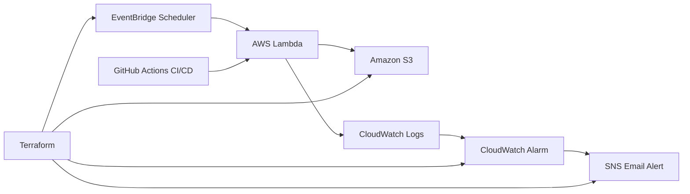

# AWS Serverless Weather Pipeline

## Overview

A serverless AWS weather data pipeline that automatically downloads the daily weather report PDF from the Sri Lanka Department of Meteorology and stores it in Amazon S3.

The solution uses Infrastructure as Code (Terraform), CI/CD (GitHub Actions), monitoring (CloudWatch), alerting (SNS), and serverless compute (AWS Lambda).

---

## Architecture



---

## Features

* Automated daily weather PDF download
* Serverless execution using AWS Lambda
* Date-based storage structure in Amazon S3
* Automated deployment using GitHub Actions
* Infrastructure management using Terraform
* CloudWatch monitoring and logging
* SNS email notifications on failures
* S3 versioning enabled
* IAM least-privilege deployment model

---

## AWS Services Used

| Service               | Purpose                |
| --------------------- | ---------------------- |
| AWS Lambda            | Download weather PDF   |
| Amazon S3             | Store downloaded files |
| EventBridge Scheduler | Daily execution        |
| CloudWatch Logs       | Logging                |
| CloudWatch Alarm      | Failure monitoring     |
| Amazon SNS            | Email notifications    |
| IAM                   | Access control         |
| Terraform             | Infrastructure as Code |

---

## Repository Structure

```text
aws-serverless-weather-pipeline
│
├── .github
│   └── workflows
│       └── deploy.yml
│
├── lambda
│   └── lambda_function.py
│
├── terraform
│   ├── main.tf
│   └── .terraform.lock.hcl
│
├── docs
│   ├── architecture.md
│   └── setup.md
│
├── README.md
├── LICENSE
└── .gitignore
```

---

## CI/CD Workflow

1. Developer pushes code to GitHub
2. GitHub Actions workflow runs
3. Lambda package is created
4. AWS Lambda is updated automatically
5. Deployment is completed without manual intervention

---

## Monitoring and Alerting

* Lambda failures are logged to CloudWatch
* CloudWatch Alarm monitors Lambda errors
* SNS sends email alerts when failures occur

---

## Cost

This project is designed to operate within the AWS Free Tier for personal and educational use.

---

## Resume Highlights

* Built a serverless AWS weather data pipeline using Lambda, S3, EventBridge Scheduler, CloudWatch, SNS, IAM, Terraform, and GitHub Actions.
* Implemented Infrastructure as Code using Terraform.
* Automated deployments through GitHub Actions CI/CD.
* Configured monitoring, alerting, and operational visibility using CloudWatch and SNS.

```
```
