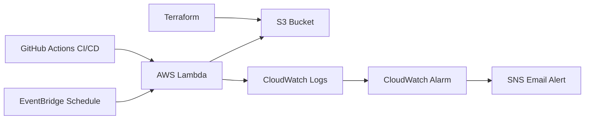

# AWS Serverless Weather Pipeline

## Overview
Serverless AWS pipeline that downloads a daily weather PDF and stores it in S3.

## Architecture
EventBridge → Lambda → S3 → CloudWatch Alarm → SNS Email

## AWS Services Used
- Lambda
- S3
- EventBridge
- CloudWatch
- SNS
- IAM

## DevOps / IaC
- GitHub Actions for CI/CD
- Terraform for S3 infrastructure management

## Features
- Daily scheduled PDF download
- Date-based S3 storage
- Automated Lambda deployment from GitHub
- S3 versioning using Terraform
- Email alerting on Lambda failures

# Architecture

